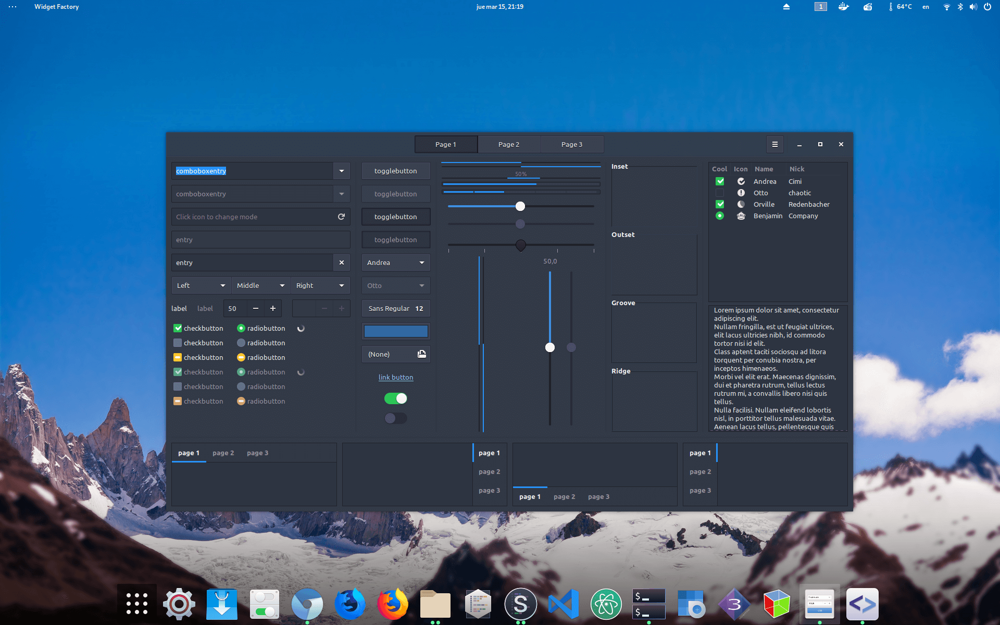
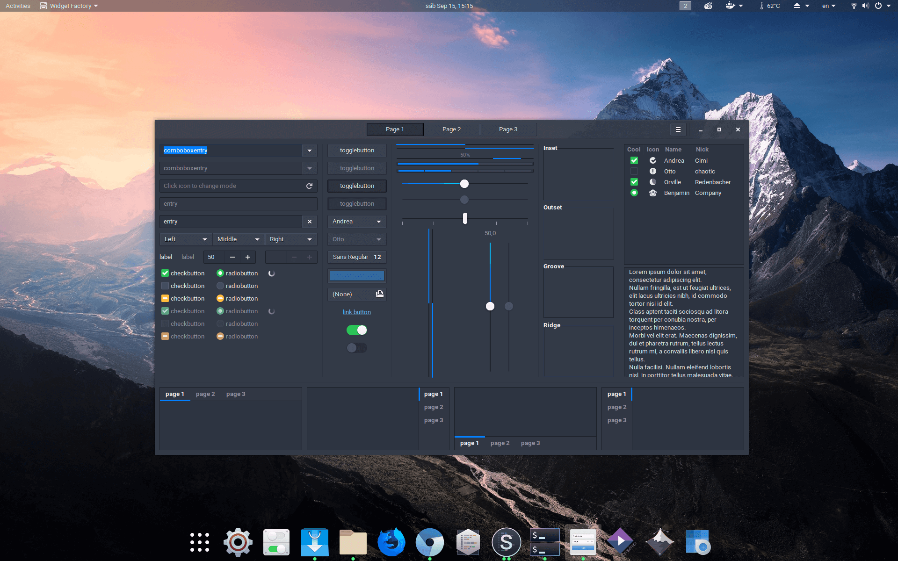
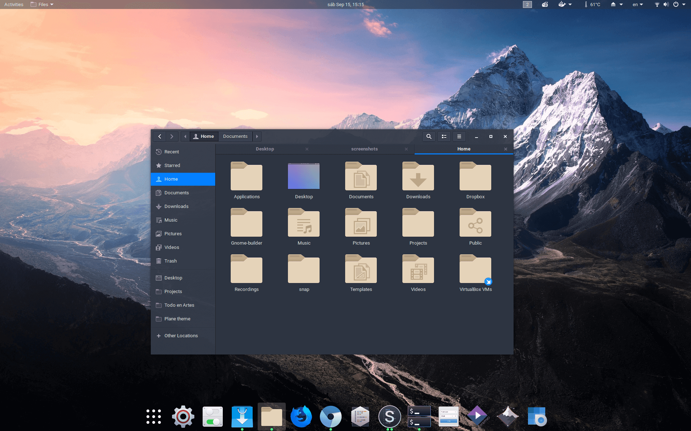
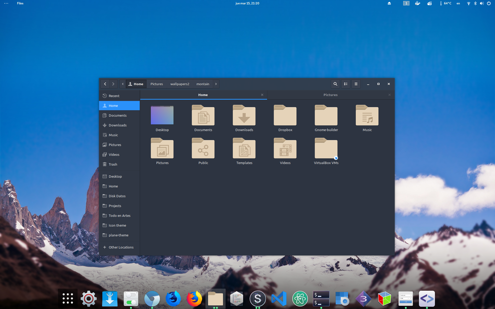
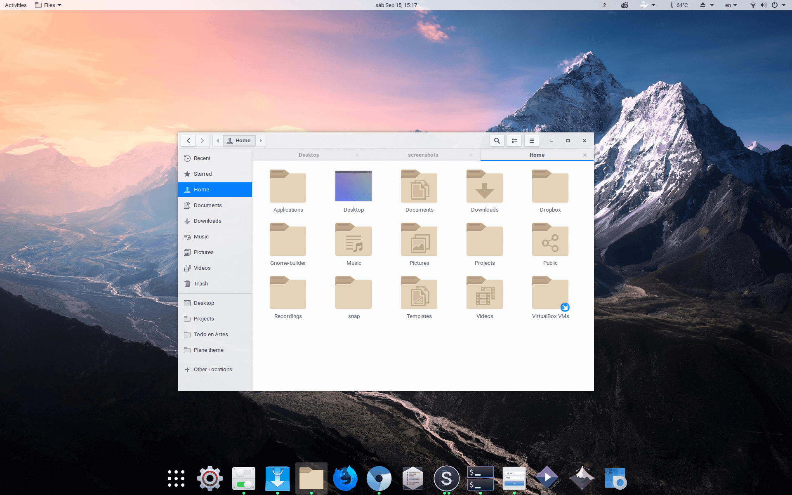
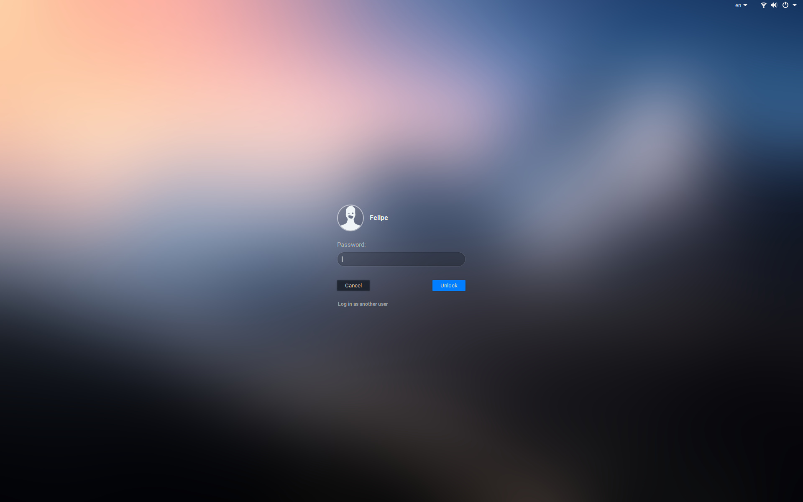

<p align="center">

</p>


# PLANE THEME

- 	A beautiful theme for Gnome Linux, more information in [Plane project](https://github.com/wfpaisa/plane)

<p align="center">

<br>

<br>

<br>

<br>

<br>

</p>

## Build

NODE: v8.12.0

NPM:  v6.4.1

```bash 

# Install node modules
$ npm i

# Build
$ gulp

# Create local .themes directory if it does not already exist
$ mkdir -p ~/.themes

# Copy white variant
$ cp -r ./build/Plane ~/.themes

# Copy dark variant
$ cp -r ./build/Plane-Dark ~/.themes

# Active white theme
$ gsettings set  org.gnome.desktop.interface gtk-theme Plane && gsettings set org.gnome.shell.extensions.user-theme name Plane

# Active dark theme
$ gsettings set  org.gnome.desktop.interface gtk-theme Plane-dark && gsettings set org.gnome.shell.extensions.user-theme name Plane-dark

```


## Build with Autoreload

```bash 

# Build and make symbolic link to themes
$ npm i
$ gulp
$ mkdir -p ~/.themes
$ ln -s $(pwd)/build/Plane ~/.themes
$ ln -s $(pwd)/build/Plane-dark ~/.themes

# Autoreload Plane
$ gulp watch

# Autoreload Plane-dark
$ gulp watch -D

```


## Update

Upstream themes are downloaded and changes monitored.

- Gtk: `/upstream/gtk-3.0` -> https://github.com/GNOME/gtk/tree/master/gtk/theme/Adwaita
- Gnome-shell: `upstream/gnome-shell` -> https://github.com/GNOME/gnome-shell/tree/master/data/theme


## GDM Theme
You can change the GDM (lock/login screen) theme by replacing the default GNOME Shell theme.
See the wiki for details: https://github.com/wfpaisa/plane-theme/wiki/GDM-Theme

## Thanks to

- Arc Theme
- Adwaita Theme

And all those designs that served as inspiration

