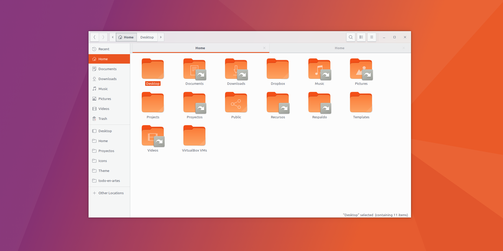
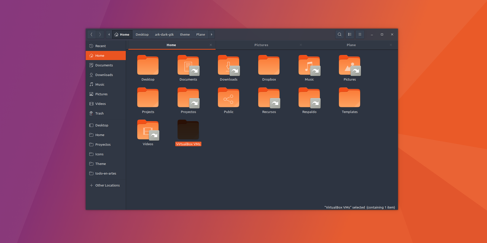

# PLANE THEME

-- Beta --

- 	A beautiful theme for Gnome Linux

 

## Build
- npm i
- Autoreload Plane `gulp watch`
- Autoreload Plane-dark `gulp watch -D`

## Update

Upstream themes are downloaded and changes monitored.

- Gtk: `/upstream/gtk-3.0` -> https://github.com/GNOME/gtk/tree/master/gtk/theme/Adwaita
- Gnome-shell: `upstream/gnome-shell` -> https://github.com/GNOME/gnome-shell/tree/master/data/theme
